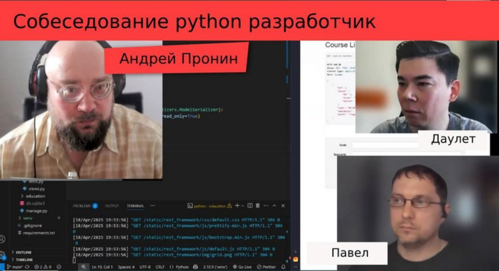

<!-- Python 3 -->
<!-- Django -->
<!-- DRF -->
  

  
  <h1 align="center">APronin_Inteview 🎓</h1>
  

    🔧 Этот репозиторий оставлен как память о публичном моковом собеседовании на канале Андрея Пронина. В рамках задания мы с напарником <strong>Даулетом</strong> успешно создали небольшой сервис на Django REST Framework (DRF), который возвращает отсортированную информацию о курсах учебного заведения. 🚀
      
    <a href="https://www.youtube.com/@AndyPronin" target="_blank">Канал Андрея</a>
    ·
    <a href="https://github.com/Dauletnazarr" target="_blank">Репозиторий Даулета</a>
    .
    <a href="https://meteopavel.space" target="_blank">Мой сайт</a>
  

## 📋 Задание

Мы должны были реализовать:
- **GET-запрос**, который возвращает информацию о курсах:
  - Код курса 🔢
  - Название курса 📚
  - Профиль курса 🎯
  - Уровень подготовки ⭐️
  - Продолжительность курса ⏳
Курс должен был быть отсортирован по определённому полю (например, по названию или продолжительности).

## 🌟 Особенности

Этот репозиторий сохраняет именно тот процесс, который происходил во время собеседования. Здесь могут быть неидеальные решения, но они показывают нашу работу в реальном времени. Это часть нашего пути обучения и развития. 🌱

## 🙏 Благодарности

Огромное спасибо:
- **Андрею Пронину** за возможность пройти такое интересное собеседование и за обратную связь. 🌟
- **Даулету** за отличную командную работу и поддержку. 👏

## 📌 PS

Если вы хотите использовать этот код, вы можете просто клонировать репозиторий и запустить его локально. Мы намеренно не добавляем инструкции по установке, чтобы сохранить его как память о нашем опыте. ✨
